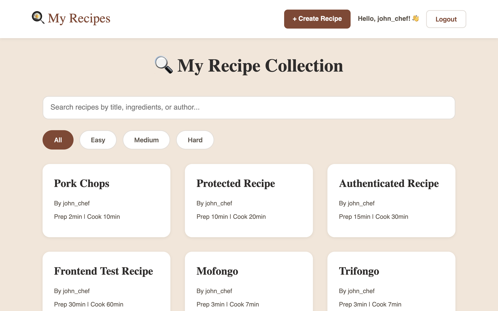

# 🍳 Recipe App

A full-stack recipe management application with user authentication.

## Features

- User authentication (signup/login)
- Create, read, update, and delete recipes
- Search and filter recipes by difficulty
- Category organization
- Responsive design

## Tech Stack

- **Frontend:** HTML, CSS, JavaScript
- **Backend:** Node.js, Express
- **Database:** SQLite
- **Authentication:** JWT

## Local Development

1. Clone the repository
2. Install dependencies: `npm install`
3. Create a `.env` file with: `JWT_SECRET=your-secret-key`
4. Start the server: `npm run dev`
5. Open `index.html` in your browser

## Live Demo

[Live demo](https://nadielotiene.github.io/recipes-app/index.html)

## Screenshots

